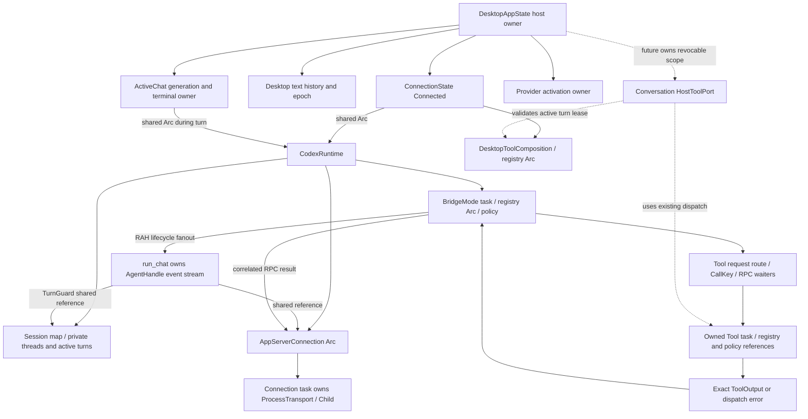

# Task 502 — production host Tool port and lifecycle ownership review

## 1. Checkpoint, scope and evidence

Reviewed starting HEAD: `eabcd2ccef976f0d10045107f442c0047476d980`.
GitHub and internal mirror master were independently read and matched this SHA.
GitHub push CI `37081552468` was independently read: completed, success,
exact head `eabcd2ccef976f0d10045107f442c0047476d980`.
The original checkout was clean at older HEAD
`d5ef2e541d744f8070019878f6754d16a4b974a8`; it is preserved. Research uses
`F:/coding/otherPrj/rah-task-502`, branch `task-502-review`, at the requested SHA.

Research/design only. Only this report changes. RAH remains 0.33.0;
HostExplicit remains exactly 11; preferred/certified Codex remains 0.157.1;
v0.34 capability is NONE SELECTED. No production construction, bridge,
permission, authority, dependency, model preflight, version, release or tag
change. Source and existing deterministic tests were inspected, not executed.
Task 501's passing gates are historical evidence, not Task 502 test runs.

Authoritative material: README, ARCHITECTURE, ARCHITECTURE_GUARDRAILS,
SECURITY; accepted ADRs 0001, 0003, 0005, 0006, 0010, 0011, 0021, 0027,
0032; Task 500/501 contract context. This proposal preserves those decisions.
Promotion of the experimental seam or replacement of production ADR 0006
composition remains a separate architecture/migration review.

## 2. Production Tool dispatch map

Source anchors below are relative to repository root at the reviewed SHA.

| Step | Exact owner/path |
| --- | --- |
| Host composition | `crates/rah-desktop/src/main.rs::connect_codex`, `desktop_tool_registry` (8064), `desktop_tool_composition_from_registry`; Trusted Profile activation supplies ordinary registered external Tools and host permission policy |
| Runtime construction | `main.rs:8485`, `CodexRuntime::connect_tool_bridge_with_model_config_and_workspace`; registry, allowed permissions, model config and host workspace supplied by Desktop |
| Thread advertisement | `crates/rah-runtime-codex/src/runtime.rs::AgentRuntime::start` (313), `bridge.rs::snapshot_tools` (87), `dynamic_tool_spec` (118); `thread/start.dynamicTools` |
| Provider request | app-server JSON-RPC `item/tool/call`; `connection.rs::run_connection` routes to its sole claimed server-request receiver |
| Bridge routing | `bridge.rs::run_bridge` (157), `handle_request` (200); parse `DynamicCallParams`; require owned active thread/turn and advertised alias |
| Correlation/deduplication | `CallKey { thread_id, turn_id, call_id }`, `CallEntry` input equality and request-ID waiters; exact duplicates share execution/cached response, conflicting replay is rejected |
| RAH call | `handle_request:330` allocates fresh `ToolCallId`, constructs canonical `ToolCall`, publishes actual `ToolRequested` |
| Admission | `authorize_tool_dispatch` checks full expected/current definition equality and membership in host allowed permission set before `ToolStarted` |
| Execution revalidation | owned bridge task calls `rah_tools::authorized_tool_dispatch` (bridge.rs:408) with expected definition, current registered Tool, host permissions and `ToolContext::default()` |
| Tool boundary | `crates/rah-tools/src/authorized_dispatch.rs`, `lib.rs::ToolRegistry::execute` -> `Tool::execute`; Tool's workspace/sandbox/capability policies remain authoritative |
| Completion | `ExecutionResult` channel -> `finish_execution` (426), real `ToolFinished` for `Ok(ToolOutput)`, distinct permission/Tool failure events otherwise |
| Provider response | `output_response` (721) -> `AppServerConnection::respond_result` for every waiting RPC request ID; Codex contentItems and success translation stays adapter-private |
| Desktop observation | connection fanout -> `runtime.rs::event_stream` -> `AgentHandle::into_runtime_events` -> `main.rs::run_chat`; activity and repository review/refresh logic |

There is no direct Desktop callback in each Codex Tool request: Desktop builds
the authority-bearing composition, then the adapter's existing bridge owns
request dispatch. The shared neutral dispatch primitive already exists.
`authorized_tool_dispatch` is not a whole authorization system: it enforces
definition/permission admission and registry execution; host composition and
Tool-specific policy supply the remaining authority boundaries.

## 3. ToolRegistry ownership and authorization

Desktop constructs a mutable local registry and publishes an `Arc<ToolRegistry>`.
`effective_authority.rs::DesktopToolComposition` (226) retains that Arc and
descriptive classifications/preparers. `ConnectionState::Connected` (main.rs:248)
retains the composition and `Arc<CodexRuntime>`. `BridgeConfig` retains another
registry Arc and an immutable allowed-permission vector. Spawned executions
clone these Arcs. Registration requires `&mut ToolRegistry`; the current bridge
does not register Tools. The future adapter must not receive even the registry
Arc: `get` and `execute` would provide a bypass around the host port.

Desktop captures the active `DesktopRepository` during connection composition.
`desktop_tool_registry` builds repository-bound first-party Tools from host root,
Git executable and capability authorities. External providers are composed by
the host's selected Trusted Profile. Missing external permission assignments
fail before registration. Execute membership does not manufacture mutation,
index, commit or other narrower authority. Reviewed commit control remains
host-owned, paired, revocable and one-shot. `ToolContext` is currently an empty
neutral struct (`rah-tools/src/lib.rs:169`), created at dispatch, not a repository
selector or permission carrier. Actual repository binding lives in Tool objects.

## 4. Definition exposure and identity

`ToolRegistry::definitions()` returns sorted owned `ToolDefinition` values:
name, description, input_schema, permission. `snapshot_tools` keeps complete
definitions and private bidirectional aliases. Codex wire specs contain alias,
description and inputSchema; permission stays host-side. Unusable Codex names
receive private aliases; canonical RAH names remain independent.

Task 501 `experimental::ToolSnapshot(Vec<ToolDefinition>)` can be derived from
the same registry method with no mutation handle. No current definition field
is missing. Provider namespace, private alias, RPC IDs, repository paths and
HostExplicit eligibility are deliberately not neutral advertisement fields.
Keep the expected host snapshot immutable for a conversation/thread; recheck
the current definition at dispatch. Advertisement never grants permission.

| Identity | Current role | Neutral disposition |
| --- | --- | --- |
| Codex thread ID / turn ID | private route to an active `SessionRecord` | adapter-private |
| Codex callId | provider logical call, part of `CallKey` | adapter-private dedupe key |
| JSON-RPC request ID (`serde_json::Value`) | transport request/response, multiple IDs may wait for one call | adapter-private |
| `ToolCallId` | newly allocated RAH execution/activity identity | host-owned, emitted in lifecycle events |
| `SessionId` | Desktop's operation/turn identity; legacy record maps to a thread | neutral owned turn identity; must be validated, never accepted as authorization |
| `ConversationId` | new seam's host routing identity | host-owned; separate from operation and provider identity |
| Desktop chat generation and terminal owner | stale-event exclusion, exactly one terminal publication | host lifecycle bookkeeping, not provider call identity |
| Activity identity | model activity uses `ToolCallId`; HostExplicit has its own coordinator/tickets | preserve provenance; do not synthesize HostExplicit from model requests |

No generic Tool ID should be a Codex RPC ID. The adapter must deduplicate before
calling the host: Task 501 has no provider replay token, and the host must not
memoize requests by identical arguments (distinct calls may intentionally repeat).
Cancellation/terminal route invalidation must precede any new host submission.

## 5. Tool results and Task 498 failures

Task 501's `ToolReply.output` is the existing `ToolOutput`, not a new lossy DTO.
It preserves `is_error`, ordered multiple Text/Json content items, empty content,
Tool-specific statuses and uncertainty payloads. `Ok(output)` with `is_error=true`
is an ordinary Tool result, not an adapter transport failure. A structured
`uncertain` must not become generic failure, known-no-effect or retryable failure.
Codex currently needs contentItems plus `success = !is_error`; Json becomes text
only at its wire edge. Desktop still consumes the original output.

`AuthorizedDispatchError::Rejected(AuthorizedDispatchRejection)` is distinct
from `AuthorizedDispatchError::Tool(ToolError)`. Retain that typed source in
`RuntimeFailure` per ADR 0032; provider failures retain `CodexAdapterError`
instead. Generic code need not import Codex types. A host-local wrapper can
carry admission/currentness/cancellation distinctions and delegate `source()`.
Use existing sanitized diagnostic `Turn/Operation` or `Unavailable` where
appropriate; do not misuse `ProviderRejection` for host denial. `rpc_code=None`
for host failures. Closed `AgentErrorCode::PermissionDenied` versus `Tool` must
remain in the host-produced failure event; RuntimeDiagnostic alone does not
encode that distinction. Serialize only the diagnostic/closed message, never
the source Display/Debug, registry identity, root, policy or profile data.

Current bridge `finish_execution` publishes legacy Failed events and discards
the underlying dispatch source there. Task 498's envelope can retain it in a
future binding, but Task 502 does not claim this is already implemented.

## 6. Experimental comparison and bounded revision

`crates/rah-runtime/src/experimental.rs` exposes a request-only `HostToolPort`:
definitions(), request(ToolRequest) -> Result<ToolReply, RuntimeFailure>.
`ConversationSeed` supplies its Arc. There is no registration, repository,
permission, profile, commit-control or HostExplicit mutator.

The execution/result shape fits production. The lifecycle delivery shape needs
one bounded addition: `ToolReply.events: Vec<RuntimeEvent>` is returned only
after execution. If the request errors or its future is dropped, Requested and
Started events can be lost. Production emits them before Tool completion;
Desktop uses Started to track possible effects, review invalidation and activity.
Buffering them until success would weaken that behavior.

Recommended additive seam: a host-assigned per-turn event publisher/observer,
bound privately to the active turn and supplied through host scope. Host port
execution publishes Requested/Started/Finished or typed failure as they occur
into the same owned RuntimeEventStream merge used for provider events. It must
work on both Ok and Err paths and preserve ordering per ToolCallId. Adapters
forward events; only the host constructs Tool lifecycle facts. Keep ToolReply
output intact. For compatibility, retain the buffered field only for legacy
fake consumers and explicitly select one delivery mode; never emit both copies.
The next task may choose the exact Rust observer signature, with deterministic
tests. No second authority or Tool execution implementation is needed.

Also specify (documentation/conformance, no new authority API): shutdown/close
reject subsequent operations through all retained Arcs; one active turn per
conversation for the initial Codex implementation; stream drop invalidates the
route and initiates owned cleanup; `Stopped` means confirmed provider-turn stop,
not Tool rollback. The fake's token signal alone is insufficient production
evidence for Stopped. Runtime shutdown owns conversation invalidation and cleanup
even if external conversation/control Arcs remain.

## 7. Minimum production binding and host-port lifetime

Proposed path:

```text
Codex adapter private route / dedupe / alias / response handling
  -> untrusted neutral ToolRequest(session, public name, input)
  -> RAH host scoped port + live host event publisher
  -> current host composition and active-turn admission
  -> authorize_tool_dispatch (pre-start)
  -> authorized_tool_dispatch (execution revalidation, ToolContext::default)
  -> existing ToolRegistry -> existing Tool policy / execution
  -> exact ToolOutput or typed RuntimeFailure
  -> adapter-private Codex response translation
```

The port is **conversation-scoped, with a host-owned per-turn execution lease**.
That is the narrowest exposed lifetime matching ConversationSeed and a thread's
fixed Tool snapshot across possible native turns. A runtime/application port is
too broad; a standalone turn-only seed would require changing conversation
advertisement for every call/turn. Its executable permission exists only while
the host's matching turn lease is active. Text-replay Desktop may open a fresh
conversation/thread per turn while its host transcript persists.

Host-private scope contains inert expected definitions, conversation routing,
connection/composition identity and generation tuple, a revocable host lifecycle
reference, and active session lease. Adapter sees only the trait. Keep registry,
repository and permission ownership in host state/owned execution records;
prefer a weak reference to that owner so a retained port does not keep executable
composition alive after host teardown. No adapter method can renew/revoke a
lease, select a repository, arm reviewed commit or change composition.

## 8. Repository binding and structural stale-authority prevention

Preserve current binding: host-selected repository -> connection's fixed Tool
composition -> conversation snapshot. Do not resolve a model-supplied repository
per dispatch or silently rebind an old conversation to the new active repository.
At every dispatch validate current host connection/composition and repository,
model, profile, connection generations, with commit identity currentness where
applicable. Existing `current_host_generation_tuple`, composition identity,
`connection_activation_publication_is_current`, and lifecycle coordination
provide the vocabulary and locking order, not a substitute for the new port gate.

Structural proof obligation for future implementation:

1. Under host lifecycle exclusion, require published current connection, exact
   composition and conversation scope, and matching active turn lease. Allocate
   host ToolCallId and an owned in-flight record before releasing exclusion.
2. A dispatch admission reserves lifecycle ownership through execution and
   terminal/uncertainty handling. Check and reservation are atomic relative to
   withdrawal; do not check generations, unlock, then spawn unowned execution.
3. Disconnect/hard recovery/shutdown withdraw current connection and revoke scope
   before awaiting transport/provider cleanup. Retained adapter/port/stream Arcs
   cannot restore the host-private lease. Ordinary Disconnect still rejects an
   active model turn; preserve existing HostExplicit/index exclusions separately.
4. Switch succeeds only through existing host activation transaction after its
   disconnected/busy/currentness checks. A new B composition gets a fresh epoch.
5. Old port A has no registry execution escape hatch. After revocation, weak
   owner absence or tuple/lease mismatch fails before Started/dispatch; it cannot
   execute against A or acquire B. If an A call won admission before withdrawal,
   its owned cleanup/uncertainty boundary is accounted for before switch. No
   automatic replay or assumed rollback.

Thus stale adapter retention alone cannot confer execution. This is a design
proof, not a claim that Task 501's fake already implements it. Generations alone
without atomic reservation and revocation are insufficient. Required future
tests retain old ports after disconnect/switch, race admission against revocation,
and assert zero executions on A/B for stale requests; also prove already-started
effects receive conservative terminal handling.

## 9. Runtime ownership and destruction

Desktop `ConnectionState::Connected` owns an Arc<CodexRuntime>; ActiveChat and
`run_chat` hold shared references during work. Pending connection publication
owns a newly constructed runtime until currentness checks succeed. Rejected or
stale publication explicitly shuts it down and shuts down provider activation.
Desktop separately owns `provider_activation`, allowing hard recovery to withdraw
usable connection synchronously and reap providers asynchronously.

CodexRuntime owns connection Arc, session-map Arc, BridgeMode, model configuration
and fixed workspace context. AppServerConnection owns command/fanout channels and
connection JoinHandle; `run_connection` owns the transport. ProcessTransport owns
Child, stdio and stderr collection task. Explicit shutdown sends a connection
Shutdown command, transport kills/waits for the child if running, connection task
is joined, server-request channel closes, bridge aborts/joins execution tasks,
and CodexRuntime joins the bridge. Shutdown errors propagate; runtime.shutdown
returns early if connection shutdown fails, so joining all resources cannot be
claimed for every error path.

Drop boundaries: BridgeMode::drop aborts its bridge JoinHandle;
AppServerConnection::drop aborts connection JoinHandle; ProcessTransport::drop
start_kill and stderr-task abort are best effort. CodexRuntime has no custom
Drop: its fields drop. Turn streams can retain connection/session Arcs beyond
runtime ownership. Dropping bridge execution JoinHandles alone detaches tasks;
the explicit run_bridge channel-close path uses abort_all and awaits them.
Do not treat implicit Drop as equivalent to successful explicit shutdown or
claim universal child cleanup certification. The neutral adapter must own its
task set and explicit shutdown path; conformance must exercise retained handles.

## 10. Conversation and session ownership

Desktop `DesktopConversationState` (main.rs:701) owns bounded alternating text
history, repository/model identity and epoch. Only a complete winning assistant
turn commits a user/assistant pair. Failed/cancelled/incomplete turns do not.
New conversation clears history and increments epoch; repository or model
generation change clears replay context on reconciliation. Local transcript
persistence/resume is descriptive text, never executable repository authority.

Desktop sends history plus prompt to `runtime.start` on each turn. It does not
use `resume` for native continuation. Each start creates a fresh Codex thread
and turn; legacy runtime session map retains private thread mapping until runtime
drop, with active_turn cleared on terminal/drop. Legacy resume sends thread/resume
and returns a passive stream, not a new user turn. It is not evidence for the
experimental NativeContinuation send contract; that requires adapter-local
implementation and tests.

| Object | One turn / multiple turns / reconnect / context change |
| --- | --- |
| Desktop text conversation | persists across successful turns and disconnect/reconnect with unchanged repo/model; clears on new conversation or repo/model reconciliation |
| RAH operation SessionId | allocated per start/turn; not persistent conversation identity |
| Codex thread | new per Desktop start; retained privately in runtime session map; not restored by reconnect |
| Connection/runtime process | serves multiple starts while connected; replaced on reconnect, not persisted |
| Repository/model/profile authority | host-composed and generation-bound; refreshed on connection, never restored from chat text |

The future neutral ConversationId identifies a host logical conversation, while
the adapter privately chooses replay thread creation or native continuation.
Model changes preserve host policy/replay invalidation; adapter cannot decide
repository switching or restore a previous provider thread as authority.

## 11. Turn ownership, cancellation and uncertain effects

`start_chat` takes lifecycle exclusion and HostInvocationCoordinator::begin_model,
then ChatState::Running and a fresh chat generation. `send_chat` snapshots current
runtime/context, verifies generation currentness, builds replay and spawns
`run_chat`. `run_chat` owns AgentHandle's stream, registers ActiveChat's runtime
and SessionId, consumes local RuntimeEvents and updates activity. Exactly one
TerminalOwnership winner may publish completion/cancellation/failure or persist
history; stale terminal work cannot clear a later generation.

`OwnedTurnStream`/`TurnGuard` (runtime.rs:747/760) retain connection/session state.
On provider terminal notification, clear active turn, send BridgeControl::Terminal,
mark terminal and emit one terminal event. Nonterminal stream drop sends Cancel,
queues interrupt_now and clears route; it does not synchronously confirm stop.
Tool/permission failures terminate the stream; guard cleanup interrupts remaining
provider work. This maps to owned neutral TurnHandle.events plus shareable
TurnControl, with the preceding lifecycle requirements.

`cancel_chat` marks CancelRequested for the matching generation/runtime/session.
`CodexRuntime::cancel` sends bridge Cancel, subscribes, sends turn/interrupt and
waits for the matching interrupted completion. Bridge reconcile aborts/awaits
matching execution futures, rejects waiting RPCs (-32800), prevents late route
execution and removes terminal dedupe records. Provider interrupt and Tool abort
are asynchronous branches, not a guaranteed serialized effect rollback sequence.
Desktop bounds graceful cancellation, then claims terminal and withdraws the
matching runtime for bounded hard shutdown if needed; providers are shut down
and state becomes NotConnected on success or Error on failure.

Started Tool futures may already have mutated repository or external state.
Tool-specific mutation leases, child ownership and uncertainty handling remain
authoritative. `handle_uncertain_repository_effects` (main.rs:9052) tracks pending
started external/branch activity, revokes review and refreshes repository state;
`run_chat` can retain model ownership conservatively. This is a specific predicate,
not universal proof of every Tool effect. The neutral host must preserve exact
Tool classifications/results and these existing conservative boundaries, never
translate Stopped into known-no-effect. No abort/replay policy is invented here.

## 12. Disconnect and repository switching

Ordinary `disconnect_codex` (8689) rejects active index effect, non-Idle chat,
ModelTurn or HostPrepared coordinator state. It does not cancel an active chat.
For Connected it moves runtime out and publishes Disconnecting under lifecycle
exclusion, revokes commit context, takes provider activation, awaits runtime then
provider shutdown, and finally publishes NotConnected; failure publishes Error.
No explicit thread/close RPC is issued. Process transport termination ends live
provider resources; no provider-side thread deletion guarantee is made.

Disconnect drops the published runtime/composition and its executable Tool route.
It does not clear DesktopRepository, admitted members, selected active member,
text conversation, model/profile intent or remembered workspace. Therefore
“clears all repository authority” is false: host repository policy objects remain;
connected dynamic dispatch and reviewed commit context are withdrawn. Remembered
workspace alone is descriptive, as before. Retained future ports must additionally
be revoked, not rely on Arc destruction.

Activation is checked both in `capture_activation_transaction` and final
`publish_activation_if_current` (6673), under membership/lifecycle coordination.
`repository_selection_allowed_for_connection` (8801) rejects Connecting,
Connected and Disconnecting; it permits NotConnected or Error. Thus the actual
switch gate means no usable connected runtime, not literally only NotConnected.
Chat, HostRunning/ModelTurn and index reservations also exclude switching.
Close has a stricter `close_runtime_is_disconnected` (6268): NotConnected and no
provider activation. Preserve these distinct tested predicates; do not normalize
them in an adapter. Activation revalidates membership/identity/generation and
publishes fresh repository policies while invalidating old review/workflow state.

HostRunning is not explicitly rejected by ordinary disconnect's coordinator
match (which tests ModelTurn/HostPrepared). Existing owned host execution and
activation's HostRunning exclusion remain independently relevant. The neutral
model port must not broaden or silently redesign that HostExplicit behavior.

## 13. Recovery and shutdown responsibilities

| Failure/transition | Current behavior | Ownership in neutral design |
| --- | --- | --- |
| Startup/version/schema/config failure | connection Error; staged provider activation cleaned; no usable connection publication | adapter validates transport/protocol; host owns publication and provider composition |
| Stale connection publication | reject, shutdown uncommitted runtime/providers; no late authority publication | generic host generation/currentness rule |
| Unexpected app-server exit | ProcessExited typed source -> connection Fault fanout/pending failures; transport cleanup and request receiver close -> bridge abort_all | adapter process/RPC mechanics; host receives sanitized failure |
| Failed turn | terminal failure, no completed transcript pair; active route invalidation/stream cleanup | adapter translates terminal; host owns terminal/UI/persistence |
| Failed Tool call | permission versus execution failure; exact structured error outputs preserved; no bridge retry | host dispatch/failure ownership; adapter correlation/response |
| Dead connection after stream fault | run_chat does not automatically replace Connected with NotConnected; subsequent requests may fail, reconnect is not automatic | generic explicit recovery policy must preserve this fact, not infer success/liveness from UI connection label |
| Cancellation failure/timeout | bounded hard recovery of matching runtime, provider cleanup, NotConnected/Error result | host chooses escalation; adapter implements interrupt/shutdown |
| Reconnect | fresh runtime/process, host registry/provider composition, preflight and generations; text replay may persist | host recomposes authority; adapter recreates private resources |
| Window close | CloseRequested prevents immediate close once, runs shutdown_for_exit, then closes window | generic host orchestration; adapter cleanup |

`shutdown_for_exit` (1179) clears prepared host work, withdraws Connected runtime,
awaits runtime shutdown and provider shutdown. It is not the idle-only Disconnect
command and does not promise graceful completion of active effects. Process/Drop
cleanup is best effort on failures. A future generic shutdown contract should
guarantee rejection of future operations once shutdown begins and owned cleanup
on successful shutdown, with typed failure/conservative uncertainty otherwise.
Adapter handles RPC/transport termination and child tasks; host handles port
revocation, publication, provider lifecycle and effect accounting. No OS sandbox,
network isolation, automatic retry, compensation or rollback promise.

## 14. Concurrency findings and inspected test evidence

Desktop has one published connection/runtime, one active model turn and one text
conversation. HostInvocationCoordinator excludes model turns from prepared/running
HostExplicit work; stage/unstage reservations and repository mutation leases are
additional boundaries. CodexRuntime itself has a session HashMap and no global
one-start gate: do not infer Desktop's one-turn restriction is intrinsic to the
runtime trait. Neutral initial Codex conversation should reject overlapping sends;
multiple runtime/conversation instances are not a newly authorized Desktop feature.

Bridge spawns independent Tool execution tasks for distinct calls. It tracks at
most 128 call entries (evicting completed entries when needed); this is not a
single-Tool concurrency gate. Tool-specific per-repository leases serialize
applicable mutation. One responder, route checks, snapshot checks and dedupe remain
required. No global process CWD mutation or repository selection enters adapters.

Existing deterministic tests inspected (not rerun):

- `bridge_tests.rs`: string_and_integer_request_ids_route_echo_through_registry;
  duplicate_call_executes_once_and_reuses_the_response; permission_snapshot_changes_fail_closed_even_when_new_permission_is_allowed;
  changed_description_or_schema_is_rejected_before_tool_start;
  cancellation_drops_pending_call_and_rejects_late_duplicate;
  disconnect_cancels_pending_execution_without_replay;
  trusted_profile_composed_repo_patch_cancellation_never_replays_before_or_after_mutation;
  trusted_profile_composed_repo_patch_disconnect_after_mutation_does_not_replay;
  uncertain_composed_patch_outcome_is_returned_once_without_bridge_retry.
- `main_tests.rs`: terminal_ownership_allows_exactly_one_winner_per_generation;
  stale_terminal_cannot_clear_a_later_desktop_turn;
  graceful_cancel_outcomes_are_bounded_without_starting_shutdown;
  hard_recovery_is_lazy_and_has_complete_error_and_timeout_outcomes;
  connected_repository_selection_rejects_direct_activation_without_changing_authority;
  task_321_i_real_stage_reservation_rejects_real_connect_publication;
  activation_connection_transition_wins_before_publication;
  concurrent_activations_from_one_generation_have_one_winner;
  host_running_at_activation_final_gate_blocks_publication;
  task349_close_preserves_runtime_model_and_repository_effect_owners;
  conversation_never_commits_failed_cancelled_start_or_incomplete_turns;
  conversation_context_changes_clear_history_with_closed_reasons_and_same_context_keeps_it.
- `authorized_dispatch.rs`: exact definition/permission execution, absent permission
  and definition-change denial, underlying error preservation, error-output
  preservation, no retry.

These tests establish concrete intended invariants, not proof that a new neutral
port is implemented. Drop/error paths and future stale-port/live-event races need
targeted tests in the next implementation; no material current ordering remains
unmapped that requires a separate research task before experimental adaptation.

## 15. Concrete ownership/lifetime graph



| Resource | Owner / shared reference | Cancellation boundary | Destruction/release boundary |
| --- | --- | --- | --- |
| Desktop state | Tauri managed app | host lifecycle/terminal coordinators | application teardown |
| Runtime instance | Connected or pending publication; ActiveChat/run_chat share Arc | graceful cancel versus host hard withdrawal | explicit shutdown; final Arc field drops are best effort |
| Host conversation | Desktop text state; future conversation Arc and host revocable scope | close rejects sends and revokes executable scope | new context/new conversation; instance shutdown invalidates retained handles |
| Private Codex thread | SessionRecord map | active-turn route cleared | map/runtime release; no current explicit thread-delete guarantee |
| Turn/control | run_chat stream and ActiveChat identity; future TurnHandle/control | provider interrupt confirmation, terminal arbitration | terminal handling or stream drop guard |
| Event stream | single AgentHandle/TurnHandle consumer, owns guard | guard queues interrupt and cancels bridge route on premature drop | stream drop releases connection/session references |
| Tool request | adapter bridge CallEntry owns route/dedupe/waiters | turn Cancel/Terminal invalidates route | terminal removes entries; cached entries bounded |
| Tool execution | bridge task map currently; future host-private task/in-flight owner | abort future is not rollback; Tool owns effect safety | explicit abort/join or terminal; effect uncertainty handled before lifecycle release |
| Tool result | completion channel then exact ToolOutput/event; private response cache | lost response never causes replay | consumption/cache removal; no authority persistence |
| Host port | conversation Arc, weak host owner and active lease in proposal | revoke before teardown awaits | retained trait Arc inert after revoke; no registry handle escapes |
```

## 16. Fake-to-production gaps

| Gap | Classification | Required handling |
| --- | --- | --- |
| Fake boolean authorization versus real registry/definition/permission/policies | straightforward adapter | call existing authorized dispatch; retain all Tool policies |
| Fake single schema versus composed sorted snapshot/private Codex aliases | straightforward adapter | snapshot neutral definitions, translate privately |
| Buffered events on successful reply only | missing contract | additive live host observer/event delivery before adaptation |
| Fake SessionId accepted without real turn/currentness ownership | authority concern | host-issued active lease and atomic validation/reservation |
| No disconnect/switch revocation in fake | authority concern | connection scope revocation, weak host ownership and generation/identity gates |
| No real in-flight effects/tasks | lifecycle concern | own execution tasks, preserve abort/join and uncertain-effect accounting |
| Fake cancel signals token; Codex requires interrupted notification | lifecycle concern | confirmed stop or typed failure/timeout, no rollback meaning |
| Fake shutdown flips alive; retained streams/resources may still exist | lifecycle concern | invalidate retained handles and release owned resources on successful shutdown |
| Fake native counter versus Codex thread/resume/turn protocol | straightforward adapter | implement real continuation privately, do not equate legacy passive resume with send |
| Fake generic failure hides permission versus Tool distinction | missing contract behavior | host live Failed code plus typed AuthorizedDispatchError source, sanitized diagnostics |
| Real RPC duplicates, conflicting IDs, aliases, request waiters | straightforward adapter | preserve adapter-private exact-once state; never put RPC IDs in neutral types |
| Fake no process/provider/schema/preflight | test-only difference | fake remains deterministic; actual adapter tests use controlled transport, current admission remains unchanged |
| Desktop activity/review/persistence/HostExplicit coordination | lifecycle concern | remain host-owned; migration tests later, no fake passing test substitutes for production proof |

## 17. Decision, readiness and recommended next task

**CONTRACT-MINOR.** Definitions, request identity, exact ToolOutput, factory,
runtime/conversation separation and typed failure envelope fit production.
Add live host Tool lifecycle delivery and explicit retained-handle/cancellation
conformance before relying on the port. This is bounded; it does not require
parallel authorization, a new capability or a core runtime model replacement.

**Codex adaptation readiness: YES**, for an experimental implementation task
that includes those bounded additions first and leaves Desktop production
composition unchanged. **NO** to wiring the unmodified buffered-only port into
production Desktop. No adaptation is begun by this task.

Recommended Task 503: implement the additive experimental live host event seam
and deterministic lifecycle/stale-port tests, then make `rah-runtime-codex`
implement the experimental configured factory/instance/conversation/owned-turn
contracts. Preserve legacy APIs and production Desktop construction/bridge,
model preflight and authority. Test actual dispatch primitive integration,
permission versus Tool typed source, exact structured/uncertain output,
duplicate call routing, cancellation before/after possible effect, stream drop,
close/shutdown with retained handles and old-port rejection after withdrawal.
No new runtime provider, Desktop migration or v0.34 capability selection.

**A — PRODUCTION HOST PORT AND LIFECYCLE BOUNDARIES READY FOR CODEX ADAPTATION**

## 18. Validation and publication

Research-only validation: `git diff --check` passed; after staging the new report,
`git diff --cached --check` also passed and inspected stat showed only this file.
No workspace
build/test suite required or run locally. Publication is one documentation commit
with message `docs: review runtime host binding and lifecycle`, normal push of
that commit to GitHub master and internal mirror master, no tag/release/version
change. Final exact SHA, push outcomes and matching natural push CI are recorded
in the completion response (self-referential commit metadata is not put into
this report). Original checkout remains preserved; report worktree must be clean.
